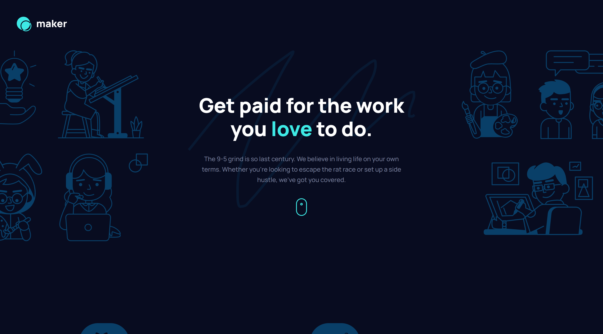

# Frontend Mentor - Maker pre-launch landing page solution



This is a solution to the [Maker pre-launch landing page challenge on Frontend Mentor](https://www.frontendmentor.io/challenges/maker-prelaunch-landing-page-WVZIJtKLd). Frontend Mentor challenges help you improve your coding skills by building realistic projects. 

## Table of contents

- [Overview](#overview)
  - [The challenge](#the-challenge)
  - [Links](#links)
- [My process](#my-process)
  - [Built with](#built-with)
  - [What I learned](#what-i-learned)
- [Author](#author)


## Overview

### The challenge

Users should be able to:

- View the optimal layout depending on their device's screen size
- See hover states for interactive elements
- Receive an error message when the form is submitted if:
  - The `Email address` field is empty should show "Oops! Please add your email"
  - The email is not formatted correctly should show "Oops! That doesn’t look like an email address"

### Links

- Solution URL: [GitHub](https://github.com/orlowski-dev/fm-maker-pre-lunch)
- Live Site URL: [GitHub Pages](https://orlowski-dev.github.io/fm-maker-pre-lunch)

## My process

### Built with

- Semantic HTML5 markup
- CSS custom properties
- Flexbox
- CSS Grid
- Mobile-first workflow
- SCSS
- [React](https://reactjs.org/) - JS library


### What I learned
 I found out I can use more than one image as background image, and specify size and position for each of them 

```css
background-image: 
  url('./assets/illustration-hero-left.svg'),
  url('./assets/bg-hero-squiggle.svg'),
  url('./assets/illustration-hero-right.svg');

background-size:
  314px 356px,
  386px 268px,
  317px 365px;

background-position:
  left calc(50% - 400px) top,
  center,
  right calc(50% - 400px) top;
```

## Author

- Frontend Mentor - [@orlowski-dev](https://www.frontendmentor.io/profile/orlowski-dev)

